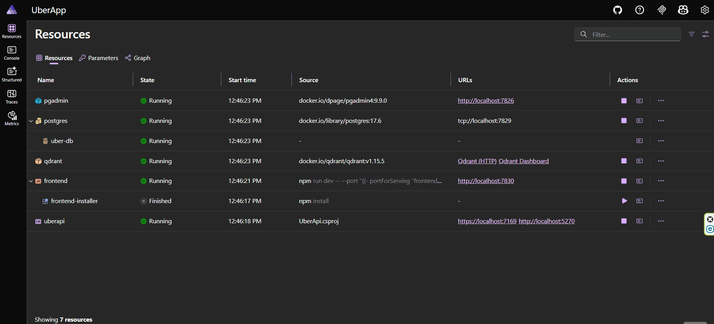

# 🚖 Uber Intelligence Platform

### End-to-End Data Engineering & AI-Powered Analytics

An advanced data platform built with **.NET Aspire**, featuring a **Medallion Architecture** pipeline, **Semantic Search** with Vector Databases, and a **Text-to-SQL Chatbot** using local LLMs.

---

## 📸 Project Showcase (Visual Tour)



> [!NOTE]
> **Language Note:** The UI is currently in Persian (RTL), but the data engine processes English datasets. Full English LTR support is easily configurable and planned for future updates.

---

## 🏗 System Architecture

The project leverages **.NET Aspire** to orchestrate a distributed environment without the complexity of manual configuration.

* **Medallion Pipeline:** Automated data flow from **Bronze** (Raw) → **Silver** (Cleaned) → **Gold** (Analytics) using **Hangfire** background jobs.
* **Semantic Search:** Vector embeddings generated via **Ollama (all-minilm)** and stored in **Qdrant**.
* **AI Chatbot:** Text-to-SQL engine powered by **DeepSeek-Coder 6.7b** to query the `uber-db` directly using natural language.

---

## 📂 Project Structure

* **`/Analyze`**: Exploratory Data Analysis (EDA). Includes `analyze.ipynb` and `eda_charts.png`.
* **`/IndexEffect`**: Performance benchmarking showing SQL execution plans before and after indexing.
* **`/Model`**: Ollama `Modelfile` for the custom `uber-sql-helper` LLM.
* **`/UberApp`**:
* `frontend`: Vite + React + Tailwind CSS dashboard.
* `UberApi`: .NET 10 Backend (Dapper, Hangfire, Qdrant Client).
* `AppHost`: Aspire Orchestrator (Api backend, Postgres and uber-db, Qdrant, Vite frontend).


---

## 🛠 Tech Stack

| Component | Technology |
| --- | --- |
| **Orchestrator** | .NET Aspire |
| **Backend** | .NET 10, Dapper, Hangfire, Scalar UI |
| **Frontend** | React, Vite, Tailwind CSS |
| **Databases** | PostgreSQL (Relational), Qdrant (Vector) |
| **AI Models** | DeepSeek-Coder 6.7b (SQL), all-minilm (Embeddings) |

---

## 🚀 Key Modules

### 📊 1. Analytics Dashboard

Real-time monitoring of 4 KPIs (Total Bookings, Success Rate, Revenue, Avg Rating) and 3 dynamic charts:

* **Cancellation Distribution** (Pie Chart).
* **Vehicle Performance** (Bar Chart: Counts with Ratings).
* **Ride Traffic** (Area Chart: Hourly trends with Min/Max/Avg stats).

### ⛓ 2. Medallion Pipeline & CSV Upload

Upload raw CSV datasets and watch the 3-stage transformation:

* **Bronze:** Raw data ingestion.
* **Silver:** Cleaning, trimming, and `COALESCE` handling.
* **Gold:** Final business-ready views.
* Managed by **Hangfire** with retry logic and history tracking.

### 🔍 3. Semantic Search (CRUD & Vector)

Manage ride records and search by "meaning" rather than keywords.

* Automatically syncs Postgres to Qdrant every 2 minutes.
* Uses **Cosine Similarity** to find related cancellation reasons.

### 💬 4. Chat with Database (Text-to-SQL)

Natural language interface for complex SQL queries.

* Local LLM generates SQL → Backend validates/executes → Frontend renders results.

---

## ⚙️ Setup & Installation

### 1. Prerequisites

* [Ollama](https://ollama.com/) installed and running.
* .NET 10 SDK & Docker Desktop.

### 2. Prepare AI Models

```bash
ollama pull all-minilm
ollama pull deepseek-coder:6.7b
# Create the custom model using the Modelfile in /Model
ollama create uber-sql-helper -f ./Model/Modelfile

```

### 3. Run the App

Open `UberApp.slnx` and run the **AppHost** project. Aspire will automatically:

1. Spin up **Postgres** (with PgAdmin).
2. Spin up **Qdrant**.
3. Launch the **Backend** (Scalar UI at `/scalar`).
4. Launch the **Frontend** (Proxied via Vite to the API).